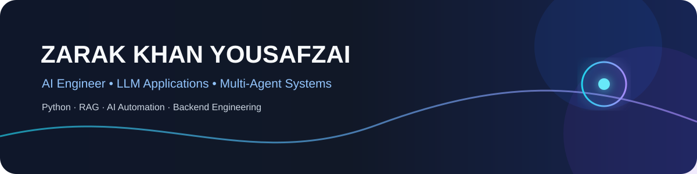
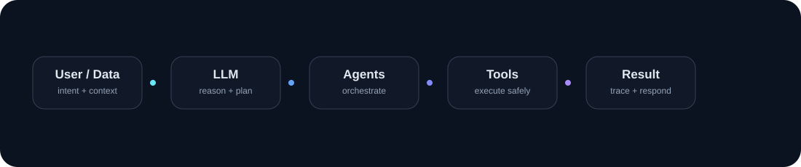

### AI & LLM Applications · Multi-Agent Systems · Python · AI Automation

Building practical AI systems around **LLM applications, agentic workflows, RAG, automation, APIs, databases and backend engineering.**

---

## 🧠 What I Build

<table>
<tr>
<td width="50%">

### 🤖 AI / LLM Engineering
- LLM application architecture
- Multi-agent systems & orchestration
- RAG & document intelligence
- Tool calling & controlled execution
- Human-in-the-loop workflows
- AI automation

</td>
<td width="50%">

### ⚙️ Software Engineering
- Python backend systems
- REST APIs & authentication
- SQL & relational data modeling
- Workflow processing
- Testing & observability
- Git, GitHub & CI

</td>
</tr>
</table>

---

## 🚀 Featured Projects

### 🏫 UniNexus AI
**Autonomous Multi-Agent University Intelligence Platform**

A portfolio/educational system exploring **multi-agent orchestration, tool execution, RAG, approvals, workflows, notifications, analytics and audit logs**.

**Highlights**
- Registered agent + tool architecture
- Structured execution and reasoning loop
- Human-in-the-loop approval flow
- Local document retrieval
- Workflow and notification system
- Multi-provider LLM integration

**Stack:** FastAPI · React · SQLAlchemy · RAG · Gemini · Groq · Ollama

---

### 📧 AI Email Automation
**LLM-Powered Email Intelligence & Response Automation**

Python automation system using a structured AI pipeline for **email classification, priority analysis, sentiment, summarization and knowledge-grounded response generation**.

**Highlights**
- Two-stage LLM processing
- Knowledge-base grounded replies
- Duplicate detection
- Database logging
- Scheduled processing support

**Stack:** Python · OpenRouter · Gmail · PostgreSQL · SQLAlchemy

---

### 🏥 MediSphere AI
**Hospital Management & Multi-Agent Assistant**

Educational Flask application exploring **specialized AI agents, orchestration, hospital-management workflows and informational automation**.

**Highlights**
- Patient and appointment workflows
- LLM-assisted intent classification
- Deterministic fallback logic
- Application-level safety constraints

**Stack:** Python · Flask · SQLite · Ollama · JavaScript

---

## 🛠️ Technology Stack

### Languages

### AI / LLM

### Backend & Data

### Frontend & Tools

### LLM Providers / Runtime

---

## 📊 GitHub Activity

 

---

## 🧭 Engineering Philosophy

> **AI features are software systems, not isolated model calls.**

- **Correctness before complexity** — deterministic behavior where appropriate.
- **Controlled AI execution** — tools, permissions, validation and approval boundaries.
- **Observable workflows** — logs, traces, audit records and tests.
- **Incremental engineering** — build → test → document → improve.
- **Honest scope** — portfolio/educational work is clearly separated from production claims.

---

## 🔄 How I Build

    Understand the problem
            ↓
    Design the system
            ↓
    Build the smallest working path
            ↓
    Integrate AI + tools + data
            ↓
    Test failure paths
            ↓
    Document architecture
            ↓
    Iterate and improve

---

## 🌐 Interactive Portfolio

A separate responsive portfolio page has been prepared in **docs/index.html** with:

- 🌑 Professional dark AI-engineer visual design
- ✨ Gradient backgrounds and smooth scrolling
- 🖱️ Hover effects and interactive project cards
- 📊 Animated portfolio counters
- 🧩 Technology stack showcase
- 📱 Mobile-responsive layout
- ✉️ Email-based contact form
- 🔗 Direct GitHub / LinkedIn / project navigation

**GitHub Pages target:** https://zarak-khan-tech.github.io/zarak-khan-tech/

> GitHub Pages must be enabled for this repository using the **docs/** folder as the publishing source.

---

## 🎯 Current Direction

Building toward **AI Engineering** through:

**LLM Applications** · **Agentic Systems** · **RAG** · **AI Automation** · **Python Backend** · **Testing** · **Deployment** · **System Reliability**

---

## 📬 Connect

  

Built and maintained by <strong>Zarak Khan Yousafzai</strong>

